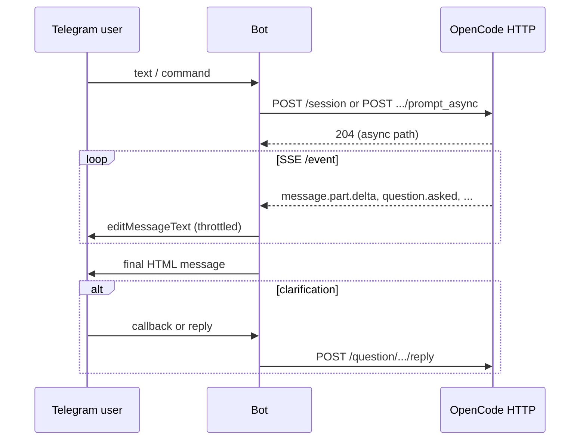

# Architecture Research

**Scope:** Telegram bot as a client/proxy for a local OpenCode HTTP server (`http://localhost:4096`).  
**Sources:** [OpenCode Server docs](https://dev.opencode.ai/docs/server) (authoritative API surface), OpenCode SDK generated types [`packages/sdk/js/src/v2/gen/types.gen.ts`](https://raw.githubusercontent.com/anomalyco/opencode/dev/packages/sdk/js/src/v2/gen/types.gen.ts) on branch `dev` (event shapes, request/response types). The `sst/opencode` GitHub URL redirects to **`anomalyco/opencode`** — same codebase.

**Naming note:** Product docs refer to “MCP questions”; in the OpenCode API/SDK these are the **question** events and `/question` HTTP routes. `QuestionRequest` includes an optional `tool` reference (`messageID`, `callID`), which ties questions to tool/MCP activity.

---

## OpenCode API

### Discovery and spec

- OpenAPI **3.1** spec UI: `GET /doc` (e.g. `http://localhost:4096/doc`).
- Default listen: **port 4096**, host **127.0.0.1** (`opencode serve`).
- Optional HTTP Basic Auth: `OPENCODE_SERVER_PASSWORD` (user defaults to `opencode` unless `OPENCODE_SERVER_USERNAME` is set).

### Project / workspace scoping

Many routes accept optional query parameters **`directory`** and **`workspace`**. The bot must use the **same `directory` (and `workspace` if applicable)** as the OpenCode project you intend to drive; otherwise session and file operations target the wrong workspace.

### Sessions and messages (core to the Telegram client)

| Method | Path | Role |
|--------|------|------|
| `GET` | `/session` | List sessions |
| `POST` | `/session` | Create session; body may include `parentID`, `title` |
| `GET` | `/session/:id` | Session details |
| `PATCH` | `/session/:id` | Update (e.g. `title`) |
| `DELETE` | `/session/:id` | Delete session |
| `POST` | `/session/:id/abort` | Abort running work — maps to `/cancel`-style UX |
| `GET` | `/session/:id/message` | List messages (`limit`, `before` query supported) |
| `POST` | `/session/:id/message` | Send message **synchronously**; waits for assistant reply; returns `{ info, parts }` |
| `POST` | `/session/:id/prompt_async` | Same body as `/message`, but **204 No Content** — use with **SSE** for streaming |
| `POST` | `/session/:id/command` | Slash commands |
| `POST` | `/session/:id/shell` | Shell command |

**Message body (prompt / async prompt)** — from generated types: optional `messageID`, `model` (`providerID`, `modelID`), `agent`, `noReply`, `format`, `system`, `variant`, `parts` (array of text/file/agent/subtask parts). `tools` on the body is marked deprecated in favor of session-level permissions.

**Session model (`Session`):** `id`, `slug`, `projectID`, optional `workspaceID`, `directory`, `parentID`, `title`, `version`, `time`, optional `permission`, `share`, etc.

### Server-Sent Events (streaming and live UI)

| Method | Path | Role |
|--------|------|------|
| `GET` | `/event` | **Project-scoped** SSE: “First event is `server.connected`, then bus events” (per server docs) |
| `GET` | `/global/event` | **Global** SSE stream |

Generated types name the subscription `EventSubscribeData` with `url: "/event"` and response **event stream** of discriminated union `Event`.

**Streaming-relevant event types** (non-exhaustive; see `Event` union in `types.gen.ts`):

| `type` string | Purpose |
|----------------|---------|
| `server.connected` | Initial handshake on `/event` |
| `message.part.delta` | `properties`: `sessionID`, `messageID`, `partID`, `field`, `delta` — **incremental token/text** |
| `message.updated` / `message.part.updated` | Coarse-grained updates |
| `message.removed` / `message.part.removed` | Deletions |
| `session.status` / `session.idle` | Run state — useful to know when a turn finished |
| `question.asked` | Interactive **question** (see below) |
| `question.replied` / `question.rejected` | Question lifecycle |
| `permission.asked` / `permission.replied` | Sandbox/tool **permissions** (separate from questions) |

**Answer path for interactive questions (HTTP):**

| Method | Path | Role |
|--------|------|------|
| `GET` | `/question` | List pending `QuestionRequest[]` |
| `POST` | `/question/{requestID}/reply` | Body: `{ answers: QuestionAnswer[] }` where `QuestionAnswer` is `Array<string>` — answers **in question order** |
| `POST` | `/question/{requestID}/reject` | Reject |

**`QuestionRequest`:** `id`, `sessionID`, `questions: QuestionInfo[]`, optional `tool: { messageID, callID }`.  
**`QuestionInfo`:** `question`, `header` (short label), `options: QuestionOption[]` (`label`, `description`), optional `multiple`, `custom` (allow free text; default true in type comments).

**Permissions (HTTP):** `GET /permission`, `POST /permission/{requestID}/reply` with `{ reply: "once" | "always" | "reject", message? }`, plus `POST /session/{sessionID}/permissions/{permissionID}` for structured permission responses (see spec).

### What “mcp_question” means here

There is **no** event type literally named `mcp_question` in the generated `Event` union. The product requirement maps to:

- SSE: **`question.asked`** / **`question.replied`** / **`question.rejected`**
- HTTP: **`/question`** list and **`/question/{requestID}/reply`**

The optional `tool` field on `QuestionRequest` links the question to a specific tool call (including MCP-driven flows).

### Other useful endpoints

- `GET /global/health` — health/version
- `GET /config`, `PATCH /config`, `GET /config/providers` — model/provider configuration (for “model switching”)
- `GET /agent` — list agents
- `GET /mcp` — MCP status; `POST /mcp` — add MCP server dynamically

---

## System Components

| Component | Responsibility | Talks to |
|-----------|----------------|----------|
| **Telegram transport** | Webhook or long-polling; parses updates, send/edit/delete messages, inline keyboards, callbacks | Telegram Bot API only |
| **Access control** | Allowlist Telegram user IDs; drop others | Internal |
| **Chat ↔ session registry** | Map `chat_id` → OpenCode `sessionID`, named sessions, “active” session | In-memory and/or small persistence layer |
| **OpenCode REST client** | `POST /session`, `POST .../prompt_async`, `GET .../message`, `POST .../abort`, `GET/PATCH /config`, file-related APIs for uploads | OpenCode HTTP |
| **OpenCode SSE client** | Long-lived `GET /event` (and optionally `/global/event`); parse `Event` stream | OpenCode HTTP |
| **Stream aggregator** | Subscribe to `message.part.delta` (and related) for the **current** `sessionID`/`messageID`; build running assistant text | SSE client |
| **Telegram render pipeline** | Markdown → Telegram-safe **HTML**; truncate to 4096 for previews; escape/validate for `parse_mode` | Telegram transport |
| **Edit scheduler** | Rate-limit `editMessageText` while streaming | Telegram transport |
| **Question & permission UI** | On `question.asked`: show inline options + optional free-text; on `permission.asked`: appropriate prompts; call **`/question/.../reply`** or **`/permission/.../reply`** | OpenCode REST |
| **Logging** | Structured log of Telegram ↔ OpenCode (console/file per PROJECT.md) | OS |

**Boundary rule:** Telegram IDs never go to OpenCode; OpenCode session IDs never go to users except indirectly via bot messages if you choose to show them in `/status`.

---

## Data Flow

1. **User message** → Telegram update → allowlist check → resolve **OpenCode `sessionID`** for this chat (create via `POST /session` if needed) → **`POST /session/{id}/prompt_async`** with text/file parts.
2. **Parallel:** SSE client receives **`message.part.delta`** (and related events) for that `sessionID` → aggregator updates running text → **throttled** `editMessageText` on a single “status” message.
3. **Turn complete** → infer from **`session.idle`** / `message.updated` / end of deltas (validate against your OpenCode version) → **final** `editMessageText` or new message with fully converted HTML; optionally delete intermediate if UX requires.
4. **Question** → SSE **`question.asked`** (or poll `GET /question`) → Telegram inline keyboard / free-text → **`POST /question/{requestID}/reply`** with ordered `answers`.
5. **Permission** → SSE **`permission.asked`** → user choice → **`POST /permission/{requestID}/reply`** (or session permission endpoint per spec).
6. **Cancel** → **`POST /session/{id}/abort`** → stop UI spinner; SSE may emit terminal events.

---

## State Management

| Concern | Recommendation |
|---------|----------------|
| **OpenCode `sessionID` per Telegram chat** | **In-memory map** (`chat_id` → `{ defaultSessionId, namedSessions, activeSessionId }`) is enough for local single-user or small allowlists. |
| **Persistence** | Optional **JSON/SQLite** file if restarts should not lose session bindings. PROJECT.md defers heavy persistence — start in-memory; add file persistence if losing the mapping is painful. |
| **SSE connection** | One **shared** `/event` connection per bot process is typical; filter events by `sessionID`. Reconnect with backoff; on reconnect, refetch `GET /session/:id/message` if needed for consistency. |
| **Streaming state** | Per active turn: `{ sessionID, messageID, partID?, buffer, lastEditAt, telegramMessageId }`. Clear on idle/error. |
| **Pending questions** | Map `requestID` → `{ chatId, messageId?, question UI state }` until `question.replied` or HTTP reply completes. |
| **Concurrency** | Serialize prompts per **session** (queue user messages) to avoid interleaved deltas; optionally allow parallelism across different chats. |

---

## Build Order

1. **OpenCode client foundation** — health check, config, `POST /session`, `GET /session/:id/message`, auth header if used.
2. **SSE consumer** — connect `/event`, parse `Event`, log `server.connected`; filter by `sessionID`.
3. **Minimal Telegram echo** — allowlist, receive text, `prompt_async`, stream deltas → **one** editing message with **throttled** edits.
4. **Markdown → HTML** pipeline and final message replacement when turn completes.
5. **Session commands** — `/new`, `/switch`, `/sessions`, `/status`; map chat → sessions.
6. **Questions** — handle `question.asked` + `POST /question/{id}/reply`; inline keyboard when `options` exist, text when `custom`.
7. **Permissions** — `permission.asked` + reply endpoints.
8. **Advanced** — file uploads as file parts, model switching via `/config` or prompt `model`, `/cancel` → `POST .../abort`, logging.

**Dependency rationale:** Without (1)+(2)+(3) you cannot verify streaming. Session registry (5) can slip in after first vertical slice if you hardcode one session for a spike.

---

## SSE streaming → Telegram message editing (recommended pattern)

- Use **`prompt_async` + `/event`**, not synchronous `POST /message`, when you need live tokens (sync endpoint waits for completion).
- Maintain **one Telegram message** per assistant turn for streaming; use `editMessageText` with `parse_mode: HTML` only when the partial buffer is valid HTML, or stream as **plain text** during the run and **replace** with formatted HTML at end (simpler and avoids broken tags mid-flight).
- **Throttle** edits (e.g. 300–800 ms) and **coalesce** deltas; Telegram enforces rate limits per chat/bot.
- Enforce **4096 character** Telegram limit for any single message body; truncate with a visible indicator during stream, or split (advanced).
- On completion, optionally **replace** the last partial with a **clean final** message (PROJECT.md: stream live, then clean final output).

---

## Quality gate checklist

- [x] OpenCode API endpoints documented from **official server docs** + **generated SDK types** (not guesses).
- [x] Components and boundaries defined (Telegram vs OpenCode vs local state).
- [x] Data flow direction explicit (Telegram → OpenCode → SSE → Telegram).
- [x] Build order and dependencies stated.
